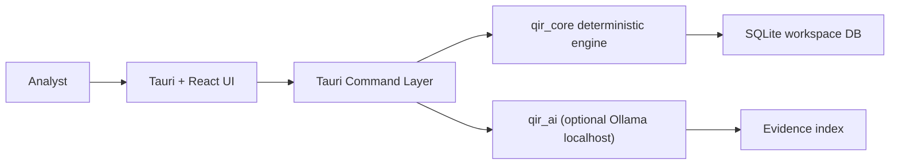

# Architecture Overview

## System Boundaries
IncidentReview owns local ingest, deterministic metric computation, dashboard rendering, and report generation for incident review workflows. It does not depend on external SaaS APIs at runtime.

## Data Flow

## Critical Modules
- `crates/qir_core`: deterministic ingest, validation, metrics, analytics, reports.
- `crates/qir_ai`: local-only AI drafting, retrieval, citation guardrails.
- `src-tauri`: command boundary and app error mapping.
- `src`: UI state, rendering, interaction contracts.

## Failure Playbook Index
- Workspace migration failures: review `WORKSPACE_*` guidance and migration status checks.
- Import failures: inspect `INGEST_*` error codes and validation report details.
- AI citation failures: `AI_CITATION_REQUIRED` must block draft completion.
